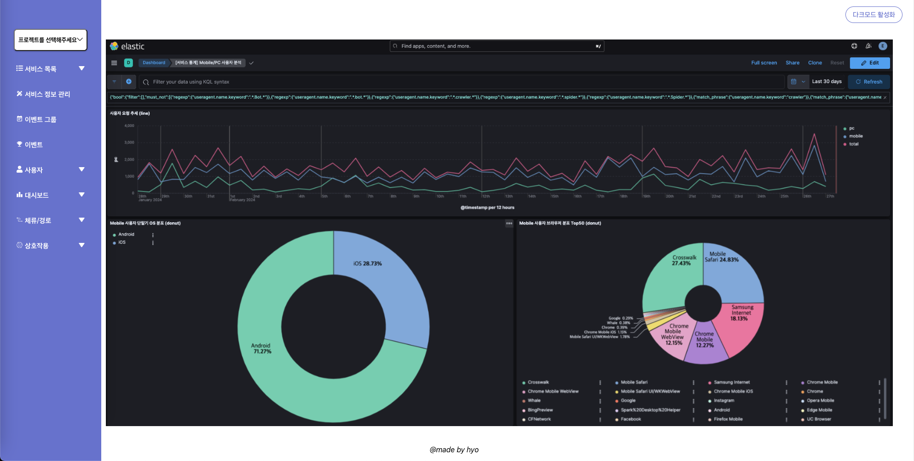
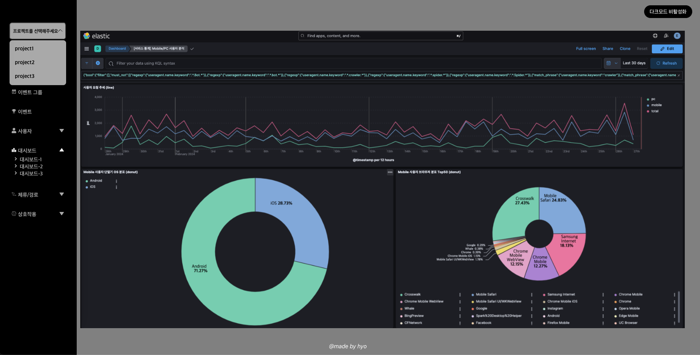

# Today I Learned
- useState Hook과 컴포넌트간에 props를 전달한 컴포넌트 상태 관리를 해보았다. (사이드바 토글 버튼 / 프로젝트 menu dropdown / 다크모드 기능)
- styled-components 방식을 채택하여 컴포넌트 스타일 정의를 해보았다.
- localStorage를 사용하여 theme 상태를 저장해서 새로고침 시에도 다크모드를 유지시켜보았다.
- resource 디폴드 경로가 어디인지 알아보았고 그 경로를 변경해 보았다.
- 프로젝트 dropdown에서 버튼 이외의 공간을 감지하여 프로젝트 선택창이 닫히도록 useRef를 사용해 보았다.
---
### 다크모드 비활성화

### 다크모드 활성화

